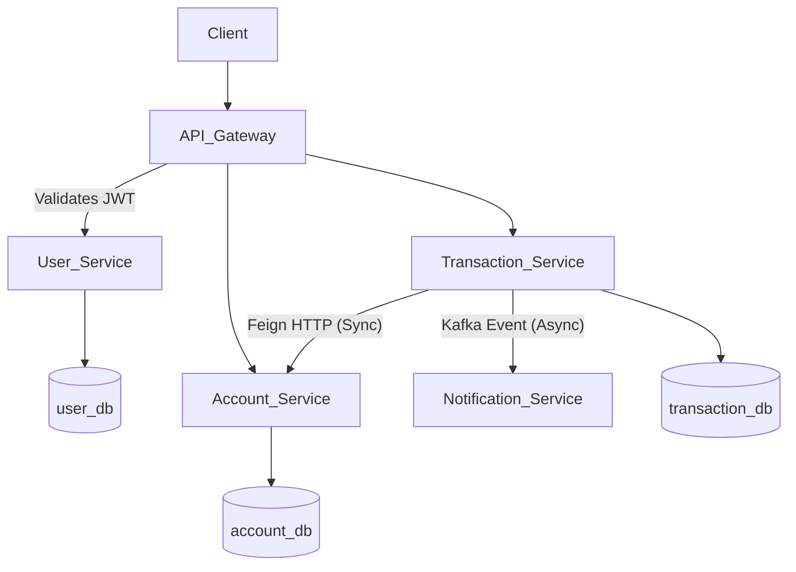

# Bank Management Architecture

This project strictly follows the **Microservices Architecture pattern**.

## Components

1. **API Gateway (Port 8080)**
   - Powered by Spring Cloud Gateway MVC.
   - Entry point for all external client requests.
   - Secures the backend by validating JWT tokens and passing standard user headers internally.
   
2. **Eureka Service Registry (Port 8761)**
   - Powered by Spring Cloud Netflix Eureka.
   - All microservices register their IP and Ports here dynamically so they can speak to each other by logically resolving names (e.g., `http://account-service`).
   
3. **User Service (Port 8081)**
   - Manages user identity, registration, and generates JWT tokens using `jjwt`.
   
4. **Account Service (Port 8082)**
   - Manages checking/savings accounts and individual balances. Accessible securely via gateway or internally by other microservices.

5. **Transaction Service (Port 8083)**
   - Acts as a high-level transaction orchestrator. To process a `Transfer`, it connects to `account-service` via **Synchronous OpenFeign Clients** to execute a coordinated withdraw and deposit.
   - On success, it guarantees alerting by triggering a lightweight event using **Asynchronous Kafka Pub/Sub**.

6. **Notification Service (Port 8084)**
   - Dedicated Kafka Consumer that listens closely to the `transactionTopic` and acts independently to alert users asynchronously, keeping the REST response incredibly fast.

## Data & Messaging Layer
- **MySQL**: Relational storage utilizing the `database-per-service` isolation pattern for decoupling and high cohesion.
- **Apache Kafka + Zookeeper**: Event-Driven message broker for resilient internal message passing.

## Complete Data Flow Diagram

